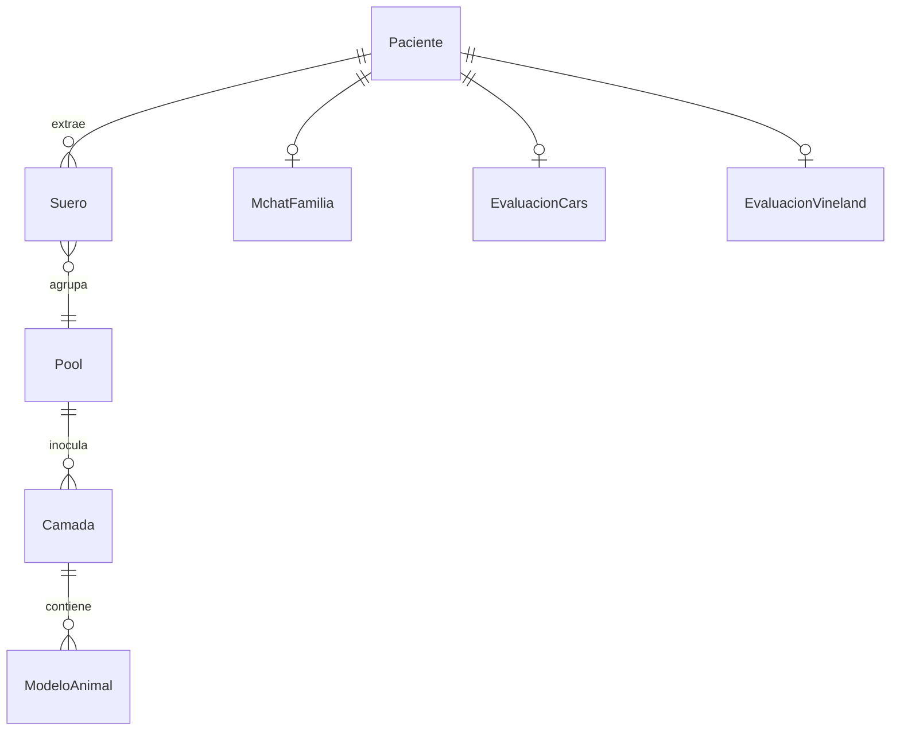

<p align="center">
  
</p>

<h1 align="center">MAG-TEA</h1>

<p align="center">
  Plataforma digital de gestión para el protocolo de investigación clínica sobre anticuerpos anti-MAG en Trastorno del Espectro Autista.
</p>

<p align="center">
  
  
  
  
  
</p>

---

## ¿Qué es esto?

**MAG-TEA** es la plataforma web desarrollada como Trabajo Final Integrador (TFI) para la **Tecnicatura Universitaria en Programación (TUP)** de la **Universidad Tecnológica Nacional (UTN)**.

Desde la perspectiva del producto, el sistema digitaliza y centraliza el flujo de trabajo completo de un protocolo clínico homónimo, una investigación biomédica coordinada entre el **Centro Wernicke**, el **CIQUIBIC (CONICET)** y el **Laboratorio Castillo Chidiak** de Córdoba, Argentina.

La investigación estudia si el sistema inmunológico produce, durante el neurodesarrollo, autoanticuerpos contra la Glicoproteína Asociada a Mielina (MAG) en niños con TEA. El seguimiento de este tipo de protocolo se realizaba en papel y hojas de cálculo inconexas; el sistema reemplaza ese flujo con un entorno centralizado, trazable y con privacidad por diseño.

---

## Pipeline del protocolo

El sistema acompaña cada etapa del protocolo, desde el primer contacto con la familia hasta el análisis en modelos animales:

```
Formulario de interés   →   Alta de Paciente         →   Etapa clínica
(portal público)            (código numérico único,       (M-CHAT - CARS-2 -
                             anonimización)                Vineland-II - Criterios -
                                                           extracción de sangre)
                                                                    ↓
Reportes                ←   Modelos Animales          ←   Sueros y Pools
(estadísticas de            (estudios conductuales -       (rangos BTU)
 cohorte - correlaciones     microscopía)                   
 clínicas - etapa básica)
```

---

## Modelo de datos



---

## Reglas del dominio

**Dos cohortes.** El protocolo maneja pacientes con diagnóstico de TEA y controles sanos (niños sin diagnóstico, para comparación estadística). El tipo se define al dar el alta y condiciona qué evaluaciones aplican.

**Flujo de estado del paciente.** El sistema impone el orden del protocolo:

```
ADMITIDO  →  MCHAT_RESPONDIDO  →  EXTRACCION_PENDIENTE  →  EXTRACCION_REALIZADA
```

**Scoring automático en escalas clínicas.**
- **M-CHAT-R/F:** enviado a la familia por email con token de acceso temporal. El sistema clasifica el riesgo (bajo / medio / alto) y habilita o no el M-CHAT de seguimiento según el puntaje.
- **CARS-2:** calcula rawScore, T-Score y percentil a partir de los 15 ítems.
- **Vineland-II:** registra los dominios de conducta adaptativa y genera el cociente final.

**Trazabilidad sin identificación personal.** Desde el suero en adelante, el identificador de paciente nunca viaja en los payloads. La trazabilidad entre etapas es exclusivamente por `codigoNumerico`.

**Etapa básica: de suero a modelo animal.** El suero extraído de cada paciente se clasifica por rango BTU y se almacena en tubos dentro de cajas. Los sueros del mismo rango se agrupan en pools para inocular camadas de ratones. Cada modelo animal recibe el registro de estudios conductuales y resultados de microscopía asociados al pool que recibió.

**Flujo de estado del modelo animal.** El sistema impone el orden del protocolo de la etapa básica:

```
PENDIENTE_INOCULACION  →  INOCULACION_EN_CURSO  →  PENDIENTE_VOCALIZACIONES →  PENDIENTE_TRES_CAMARAS  →  PENDIENTE_MICROSCOPIA  →  COMPLETO

```

---

## Stack tecnológico

| Capa | Tecnología |
|---|---|
| Backend | Java 21, Spring Boot 4.1.0, Spring Security (JWT), Spring Data JPA, Hibernate Envers |
| Frontend | Angular 21, TypeScript 5.9, Tailwind CSS v4, Signals, Zoneless |
| Base de datos | PostgreSQL 17 |
| Testing | JUnit 5, Mockito, MockMvc |
| Infraestructura | Docker, Docker Compose, Nginx |
| Integraciones | Mercado Pago Java SDK 2.1.29 |
| Utilidades | MapStruct, Lombok, springdoc-openapi |

---

## Arquitectura

```
proyecto-mag-tea/
├── backend/src/main/java/com/utn/magtea/
│   ├── config/           # SecurityConfig, CorsConfig, OpenApiConfig
│   ├── auth/             # JWT, login
│   ├── common/           # Auditable, excepciones, GlobalExceptionHandler
│   ├── profesional/
│   ├── paciente/
│   ├── formulariointeres/
│   ├── suero/
│   ├── tubo/             # tubos con tipo y vaciado
│   ├── caja/             # cajas de almacenamiento
│   ├── pool/
│   ├── camada/           # camadas de ratones
│   ├── modeloanimal/
│   ├── donacion/         # integración Mercado Pago
│   ├── reporte/
│   ├── storage/          # almacenamiento de documentos (MinIO)
│   └── inicio/           # datos del dashboard
└── frontend/src/app/
    ├── core/             # guards, interceptors, modelos, servicios globales
    ├── shared/           # DataTable, ListToolbar, ConfirmModal, StatusBadge, Paginator
    ├── public/           # landing, donaciones, formulario de interés, M-CHAT por token
    └── internal/         # portal autenticado
        ├── administracion/
        ├── profesionales/
        ├── pacientes/
        ├── formularios-interes/
        ├── sueros/
        ├── pools/
        ├── modelos-animales/
        ├── reportes/
        ├── inicio/
        └── layout/
```

Cada módulo del backend sigue la misma estructura: `Entidad.java` - `Repository` - `Service` - `Controller` - `DTO` - `Mapper` (MapStruct).

---

## Comandos

### Desarrollo

```bash
# Primera vez o tras cambios en pom.xml / package.json
docker compose -f docker-compose.yml -f docker-compose.dev.yml up --build

# Resto del tiempo
docker compose -f docker-compose.yml -f docker-compose.dev.yml up
```

| Portal | URL (dev) | URL (prod) | Acceso |
|---|---|---|---|
| Público | `http://localhost:4200` | `magtea.org` | Familias sin login: landing, formulario de interés, M-CHAT, donaciones |
| Interno | `http://app.localhost:4200` | `app.magtea.org` | Profesionales: secretaría, clínica, laboratorio, investigación |

| Servicio | URL |
|---|---|
| Landing pública | `http://localhost:4200` |
| Portal interno | `http://app.localhost:4200` |
| API REST | `http://localhost:8080` |
| Swagger UI | `http://localhost:8080/swagger-ui.html` |

### Producción

```bash
docker compose up -d      # http://localhost — Nginx sirve Angular y proxea la API
docker compose logs -f
docker compose down
```

### Tests del backend

```bash
docker compose -f docker-compose.yml -f docker-compose.dev.yml run --rm backend ./mvnw test
```

---

## Autor

**Ignacio Marucco** — Trabajo Final Integrador - Tecnicatura Universitaria en Programación - UTN FRC
